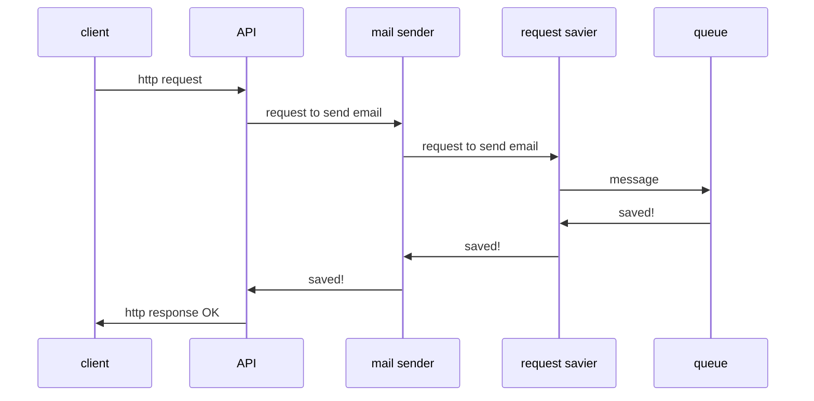
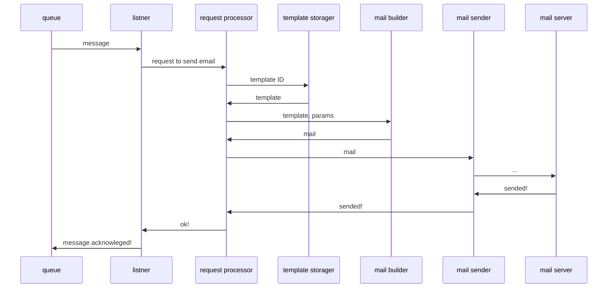
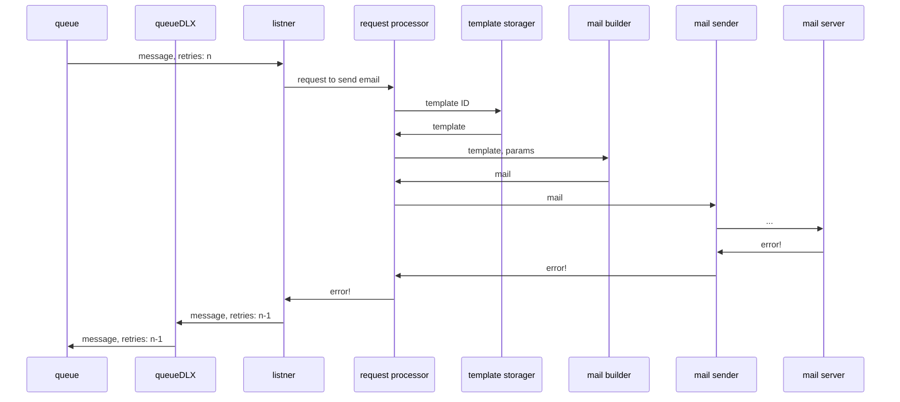

# Описание схемы работы

## Сущности

* Письмо;
* Шаблон;
* Запрос на отправку письма.

## Компоненты

### Сервер
Сервер принимает запросы на отправку письма от клиентов и добавляет их в очередь сообщений.

### Обработчик
Обработчик отправляет письмо при появлении сообщения в очереди.

### Очередь сообщений
Очередь сообщений получает сообщения от сервера и передает их обработчику.

## Модули сервера

### Отправщик писем
Модуль реализует бизнес-логику сервера. Принимает на вход **запрос на отправку письма** и отправляет его в **модуль записи в очередь сообщений**.

### API
Модуль обрабатывает HTTP запрос и передает на обработку **отправщику писем**.

### Модуль записи в очередь сообщений
Модуль получает сообщение и сохраняет ее в очередь сообщений.

## Модули обработчика

Пример успешной обработки сообщения:

В случае ошибки обработки сообщения счетчик оставшихся попыток уменьшается, сообщение попадает в очередь queueDLX на время delay, после чего снова возвращается в очередь queue:

### Слушатель сообщений
Модуль ждет сообщения в очереди и передает их на обработку в **обработчик запросов отправки писем**.

### Обработчик запросов отправки писем
Модуль реализует бизнес-логику обработчика. Принимает на вход **запрос на отправку письма**. Получает **шаблон** из **хранилища шаблонов**. Отправляет **шаблон** и данных для подстановки в шаблон на вход **сборщика писем**, получает сформированное **письмо**. Передает его в **отправщик писем** для отправки.

### Хранилище шаблонов
Модуль реализует метод получения шаблона по его идентификатору. Опционально — постраничное получение, добавление, редактирование и удаление шаблонов.

### Сборщик писем
Модуль формирует письмо из шаблона и данных.

### Отправщик писем
Модуль отправляет письмо, реализуя один из протоколов, например SMTP.
